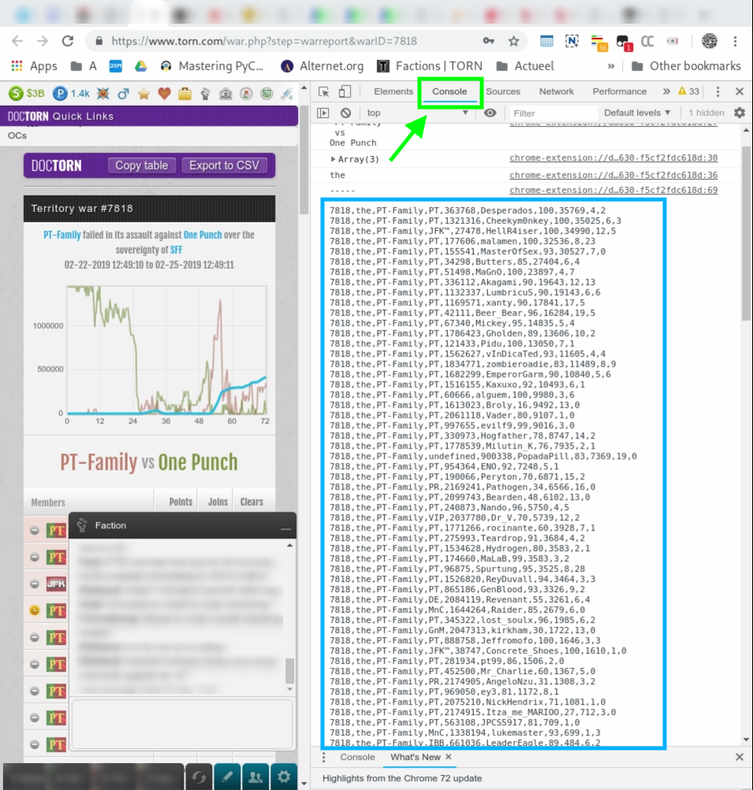

# War Reports

This code is able to analyze warreports and is used for the Insurgency - Ched's UNT world war.
The reports are in the /reports folder.

This is a summary of the files in the codebase

##warreport.py
The main file will grab all .csv files in the /reports folder and populate the members.sqlite database. 
This is the main file.

#### all_reports.txt
A list of warreports as collected by Nova [1570883]. These include all wars (and fake walls) up to 2019-03-13.

#### reports_filtered.txt
A curated list of relevant wars as provided by Proxima [1879587]. 
This list excludes fake walls (walls between members of Ched's UNT.)

#### helpers.txt
A list of players thathave contributed to data in this repository

# members.sqlite
The SQLite database where the data is stored. This database is created and populated by the warreport.py script. 
The PHP file index.php uses data in this database for output.

Pro tip: the database is directly accessible through the URL 
https://github.com/Afwas1337627/warreports/blob/master/members.sqlite?raw=true. 
Do not click this link but use it for access through a SQLite database viewer like 
[DB Browser for SQLite](https://sqlitebrowser.org)  or the Chrome plugin [SQLite Manager](https://chrome.google.com/webstore/detail/sqlite-manager/njognipnngillknkhikjecpnbkefclfe).

## AnalyzeWarReport.usr.js
The userscript used to extract the data from the warreports.

## index.php
The output file. This file uses bootstrap plus the excellent tablesorter plugin. It has access to the members.sqlite database for input.

### ouput.csv
This is just a .csv file with all data so those interested can import the data into a spreadsheet.